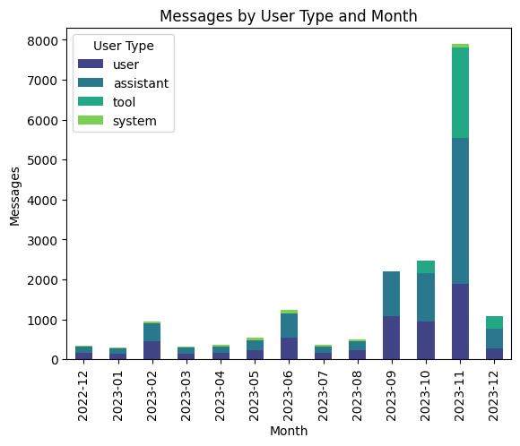

# ChatStats - Your ChatGPT Year in Review

ChatStats provides insights and analysis on your conversations with ChatGPT. Similar to Spotify's Year in Review, ChatStats offers a comprehensive overview of your chat history, highlighting key statistics and trends. As the field of prompt engineering continues to grow, ChatStats can be a valuable tool for understanding the dynamics of your chat conversations and learning how to craft more sophisticated prompts.

## Getting Started

To get started, you will need your ChatGPT chat history in JSON format. You can get this from the [ChatGPT website](https://chat.openai.com/#settings): Account Settings --> Data Controls --> Export Data.

Next, download and run the ChatStats notebook.

# Additional Resources

[New Ways to Manage Your Data in ChatGPT](https://openai.com/blog/new-ways-to-manage-your-data-in-chatgpt)
[Prompt Engineering: 6 Strategies for Getting Better Results](https://platform.openai.com/docs/guides/prompt-engineering)