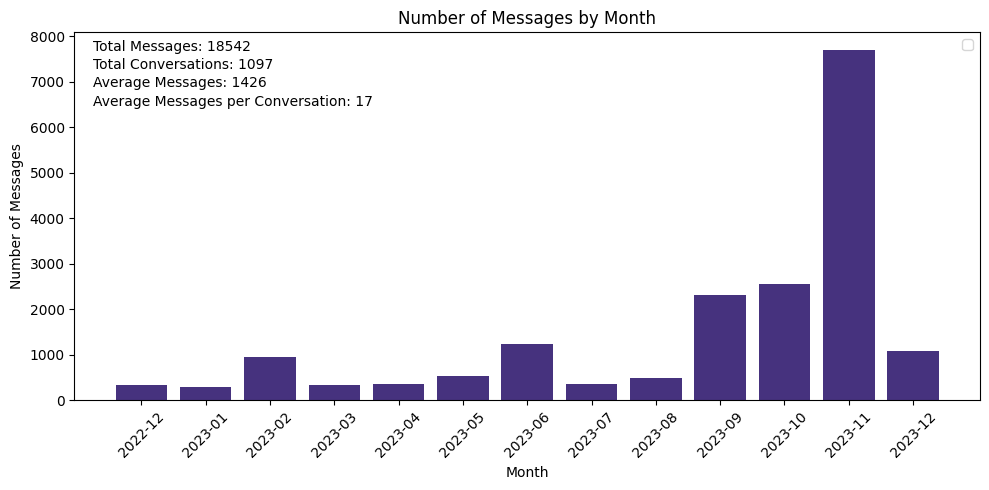

# ChatStats - Your ChatGPT Year in Review

ChatStats provides insights and analysis on your conversations with ChatGPT. Similar to Spotify's Year in Review, ChatStats offers a comprehensive overview of your chat history, highlighting key statistics and trends. As the field of prompt engineering continues to grow, ChatStats can be a valuable tool for understanding the dynamics of your chat conversations and learning how to craft more sophisticated prompts.

## Features

1. **Conversation Count**: ChatStats provides the total number of conversations in your chat history, giving you an idea of the volume of interactions.

2. **Messages per Conversation**: This metric calculates the average number of messages exchanged per conversation, helping you understand the depth of engagement.

3. **Messages by Month**: ChatStats analyzes your chat history on a monthly basis, providing a breakdown of the number of messages sent each month. This allows you to identify patterns and trends over time.

4. **User Type Analysis**: ChatStats categorizes users based on their roles (e.g., participant, moderator, tool) and provides insights into the number of messages sent by each user type. This analysis helps you understand the distribution of communication within your chat conversations.

5. **Top Tools**: If your chat conversations involve various tools or platforms, ChatStats identifies the most active tools based on the number of messages sent. This information can be valuable for assessing the sophistication of your prompts.

## Getting Started

To get started, you will need your ChatGPT chat history in JSON format. You can get this from the [ChatGPT website](https://chat.openai.com/#settings): Account Settings --> Data Controls --> Export Data.

Next, download and run the ChatStats notebook.
